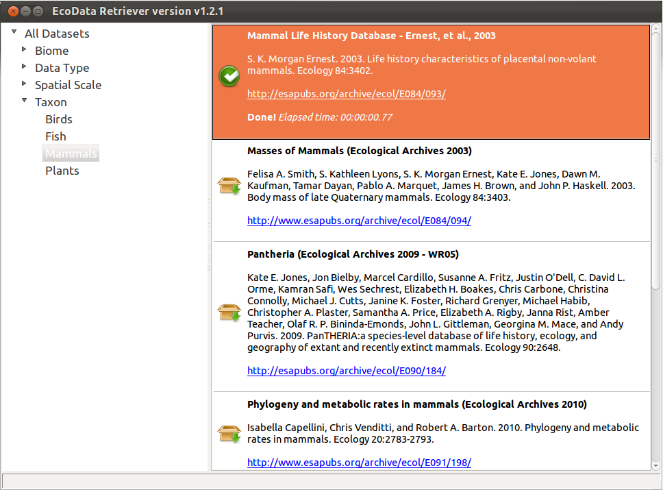

## Installing Packages

Packages are provided for Windows and Ubuntu/Debian Linux, or you can
install from the Python source.

### Windows

Simply download and run
[retriever.exe](https://s3.amazonaws.com/ecodata-retriever/retriever.exe).
This can be run as a Windows application or from the command line using
the command line interface.

### Linux

[A Debian
package](https://s3.amazonaws.com/ecodata-retriever/python-retriever_1.5-1_all.deb)
is provided; If you're on a non-Debian based system, refer to the
instructions under Installing from Source.

### Mac

Install from source. The following recipe is known to work for OSX 10.8+.

1. Install Xcode
2. Install the Xcode command line tools ``xcode-select --install``
3. Install Homebrew ``ruby -e "$(curl -fsSL https://raw.github.com/mxcl/homebrew/go)"``
4. Install Python ``brew install python``
5. Install wxPython using Homebrew ``brew install --python wxmac --devel``. **NOTE: This takes a very long time**
6. Make brew's Python the default ``echo export PATH='usr/local/bin:$PATH' >> ~/.bash_profile``
7. Install xlrd via pip ``pip install xlrd``. No ``sudo`` is necessary since we're using brew.
8. Install py2app via pip ``pip install py2app``.
9. Clone the Retriever ``git clone git@github.com:weecology/retriever.git``
10. Switch directories ``cd retriever``
11. Standard install ``python setup.py install``

## Installing from Source

To install the EcoData Retriever from source, you'll need:

-   Python version 2.7.1 or greater (not Python 3.x)
-   wxPython version 2.8; *Mac users need to use the experimental
    [wxPython version
    2.9](http://www.wxpython.org/download.php#unstable).*
-   xlrd

On Ubuntu, the following command will install all required dependencies:

`sudo apt-get install python-setuptools python-wxgtk2.8 python-xlrd`

The following packages are optional:

-   PyMySQL (preferred) or MySQLdb (for MySQL)
-   sqlite3 (for SQLite)
-   pyscopg2 (for PostgreSQL)
-   pyodbc (for Microsoft Access - this option is only available on
    Windows)

To download and install the Retriever from source, use the following
commands (Windows users should use a Unix-like environment such as Git
bash or Cygwin):

1.  `wget https://s3.amazonaws.com/ecodata-retriever/retriever-src.tar.gz`
2.  `tar -xvzf retriever-src.tar.gz`
3.  `cd src`
4.  `sudo python setup.py install`

If you prefer to install the current master branch:

1.  `git clone git@github.com:weecology/retriever.git`
2.  `cd retriever`
3.  `sudo python setup.py install`

After installing, type `retriever` to launch.

## Using the Graphical User Interface

The first time you launch the EcoData Retriever, it will automatically
download all available Retriever scripts. You'll then be prompted to
choose a database system and enter your connection information. Once
this process is complete, you'll see the following screen:

You'll see each available dataset with citation information and a link
to the dataset website. Click on the box icon to start downloading the
data.

You can use the categories on the left to filter the data to show, for
example, only data from a specific taxonomic group (like Mammals in the
image above). You can also search for specific terms using Edit \> Find.

If you need to change the database management system that you are using
just select File \> Connection from the menu.

## Using custom scripts

You can also write your own scripts for datasets that aren't currently
included in the Retriever. Follow the [instructions for adding
datasets](scripting.html) and then place your custom script in either
the directory where you are running the Retriever or in a subdirectory
named \`\`scripts\`\`.
